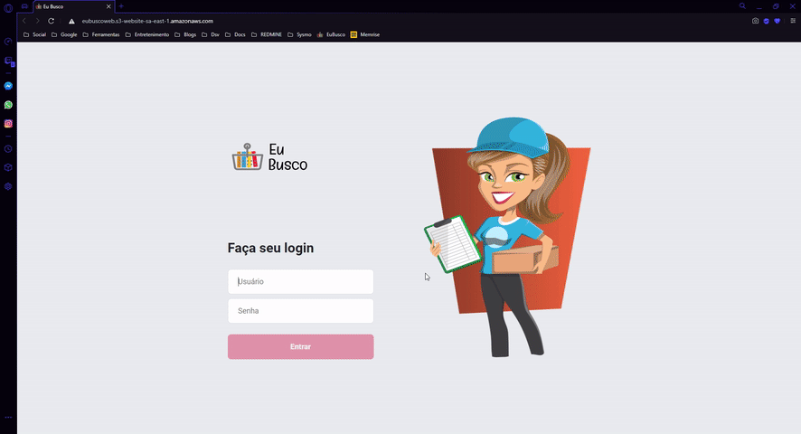
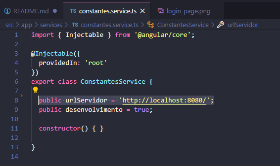

# Eu Busco Web - Sistema de gestão de entregas

> Tela inicial do sistema:



## Ver projeto

O projeto pode ser visualizado através do [link](http://eubuscoweb.s3-website-sa-east-1.amazonaws.com) que está hospedado no Amazon S3.
<br>
Usuário: admin
<br>
Senha: 123456

_Obs.: Pode demorar um pouco para startar o servidor após algum tempo parado_.

## Como subir o projeto

_É necessário ter o projeto startado [@lmoreira256/eu-busco-server](https://github.com/lmoreira256/eu-busco-server) localmente para conseguir utilizar todas as funcionalidades._

O projeto foi desenvolvido com Angular, desta forma tendo as seguintes dependências:
- NodeJS
- npm
- Angular CLI

Após clonar o projeto, instalar as dependências nas pasta raiz do projeto:
```
npm install
```

Para rodar o projeto e abrir no navegador automaticamente:
```
ng serve --open
```

## Configurações básicas

Para alterar o local do servidor é necessário acessar o [arquivo](./src/app/services/constantes.service.ts).


## Versões utilizadas no projeto
```
     _                      _                 ____ _     ___
    / \   _ __   __ _ _   _| | __ _ _ __     / ___| |   |_ _|
   / △ \ | '_ \ / _` | | | | |/ _` | '__|   | |   | |    | |
  / ___ \| | | | (_| | |_| | | (_| | |      | |___| |___ | |
 /_/   \_\_| |_|\__, |\__,_|_|\__,_|_|       \____|_____|___|
                |___/
    

Angular CLI: 8.2.1
Node: 14.3.0
OS: win32 x64
Angular: 8.2.2
```

## Considerações finais
O projeto está disponível para alterações, qualquer sugestão ou alteração será muito bem-vinda.